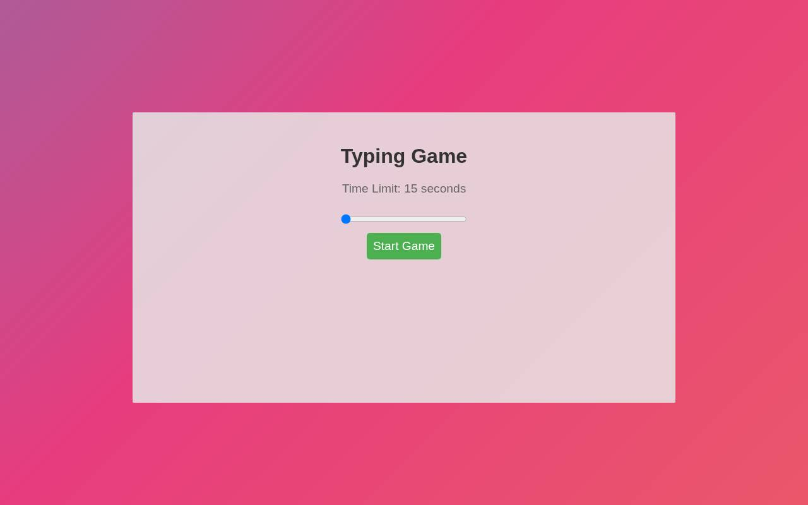

# Typing Game

A small browser typing game: type the shown sentence as fast and accurately as you can before the timer runs out.

**Live:** [typinggame.weisser.dev](https://typinggame.weisser.dev)



## Features

- Configurable time limit (slider, 15 to 600 seconds)
- Random English tongue-twister sentences
- Live feedback while typing and a result summary at the end

## Tech stack

Plain HTML, CSS and JavaScript. No dependencies, no build step.

## Run locally

Open `index.html` in a browser, or serve the folder:

```bash
python3 -m http.server 8080
```
